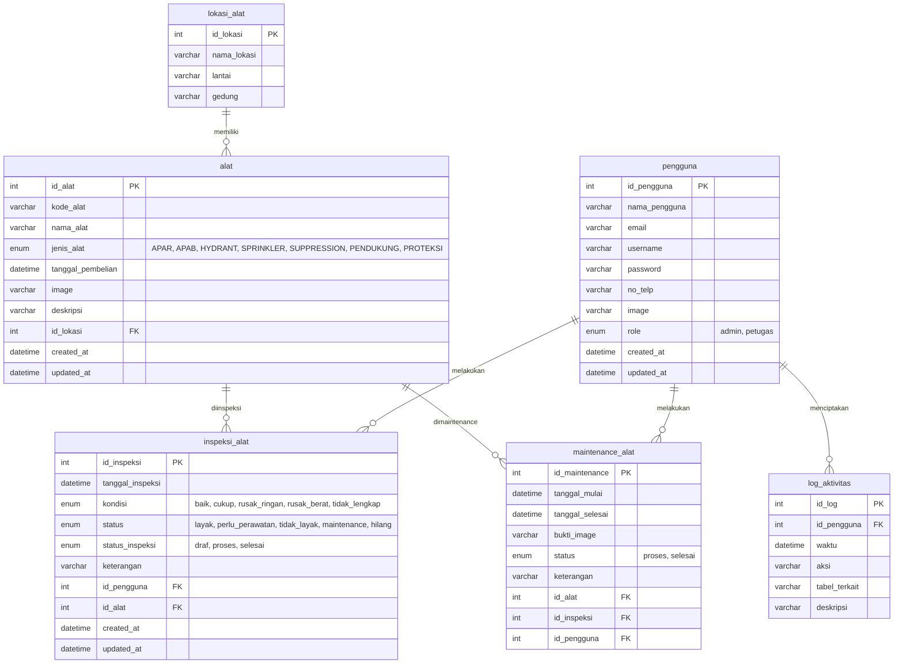

# 🚒 Sistem Monitoring Alat Damkar

## 📊 Entity Relationship Diagram (ERD)

Berikut adalah visualisasi struktur database yang akan digunakan dalam sistem ini:

```mermaid
erDiagram
    alat ||--o{ inspeksi_alat : "diinspeksi"
    alat ||--o{ maintenance_alat : "dimaintenance"
    lokasi_alat ||--o{ alat : "memiliki"
    pengguna ||--o{ inspeksi_alat : "melakukan"
    pengguna ||--o{ maintenance_alat : "melakukan"
    pengguna ||--o{ log_aktivitas : "menciptakan"

    alat {
        int id_alat PK
        varchar kode_alat
        varchar nama_alat
        enum jenis_alat "APAR, APAB, HYDRANT, SPRINKLER, SUPPRESSION, PENDUKUNG, PROTEKSI"
        datetime tanggal_pembelian
        varchar image
        varchar deskripsi
        int id_lokasi FK
        datetime created_at
        datetime updated_at
    }

    pengguna {
        int id_pengguna PK
        varchar nama_pengguna
        varchar email
        varchar username
        varchar password
        varchar no_telp
        varchar image
        enum role "admin, petugas"
        datetime created_at
        datetime updated_at
    }

    lokasi_alat {
        int id_lokasi PK
        varchar nama_lokasi
        varchar lantai
        varchar gedung
    }

    inspeksi_alat {
        int id_inspeksi PK
        datetime tanggal_inspeksi
        enum kondisi "baik, cukup, rusak_ringan, rusak_berat, tidak_lengkap"
        enum status "layak, perlu_perawatan, tidak_layak, maintenance, hilang"
        enum status_inspeksi "draf, proses, selesai"
        varchar keterangan
        int id_pengguna FK
        int id_alat FK
        datetime created_at
        datetime updated_at
    }

    maintenance_alat {
        int id_maintenance PK
        datetime tanggal_mulai
        datetime tanggal_selesai
        varchar bukti_image
        enum status "proses, selesai"
        varchar keterangan
        int id_alat FK
        int id_inspeksi FK
        int id_pengguna FK
    }

    log_aktivitas {
        int id_log PK
        int id_pengguna FK
        datetime waktu
        varchar aksi
        varchar tabel_terkait
        varchar deskripsi
    }

```

