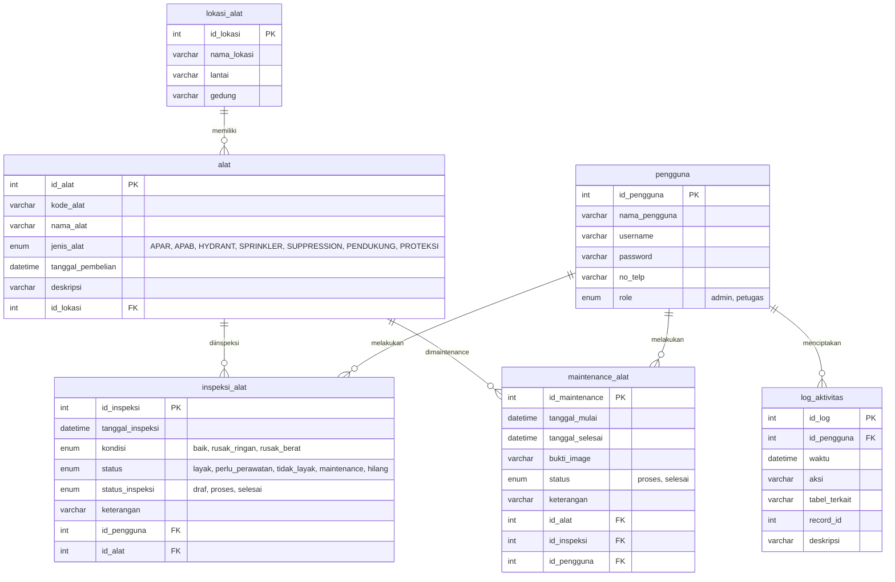

# 🚒 Sistem Monitoring Alat Damkar
Aplikasi desktop berbasis **Java Swing** yang digunakan untuk memonitor kondisi alat pemadam kebakaran, mulai dari pendataan alat, inspeksi, maintenance, hingga pencatatan log aktivitas pengguna.

---

## 🔑 Informasi Login

### 👨‍💼 Admin
| Username | Password |
|----------|----------|
| `admin` | `admin` |

### 👨‍🔧 Petugas
| Username | Password |
|----------|----------|
| `petugas` | `petugas` |

> **Catatan:** Password pada database disimpan menggunakan **BCrypt** sehingga lebih aman.

---

## 🛠️ Spesifikasi Aplikasi

| Komponen | Teknologi |
|----------|-----------|
| Bahasa Pemrograman | Java |
| IDE | Apache NetBeans 29 |
| Build Tool | Apache Maven |
| Framework GUI | Java Swing |
| Database | MySQL |
| Library Enkripsi Password | BCrypt |
| Library Reporting | iReport 5.6 (JasperReports) |
| Arsitektur | MVC (Model-View-Controller) |

---

## ✨ Fitur Utama

- 🔐 Login Multi Role (Admin & Petugas)
- 👥 Manajemen Pengguna
- 🚒 Manajemen Data Alat Pemadam
- 📍 Manajemen Lokasi Alat
- 📝 Inspeksi Alat
- 🔧 Maintenance Alat
- 📊 Dashboard Monitoring
- 📄 Cetak Laporan menggunakan iReport
- 📜 Log Aktivitas Pengguna
- 🖼️ Upload Gambar Bukti Maintenance

---

## 👥 Anggota Kelompok

| No | Nama | NPM |
|----|------|-----|
| 1 | Yuriko Farhan | 202343501378 |
| 2 | Muhammad Dennis Abimanyu | 202343501359 |
| 3 | Dwi Wahyuni | 202343501396 |
| 4 | Syahria Mufida Indri Maulia | 202343501404 |
| 5 | Riska Hermeinasyah Fatihah | 202343501366 |
| 6 | Muhamad Arief Budhiyanto | 202343501367 |
| 7 | Muhammad Fahrezy | 202343501395 |
| 8 | Muhammad Hafizh Mukhlish Iskandar | 202343501381 |

---

## 📊 Entity Relationship Diagram (ERD)

Berikut adalah visualisasi struktur database yang digunakan dalam sistem ini:

